# Interfaz Gráfica en Java

Curso propuesto por el grupo de trabajo Semana de Ingenio y Diseño (**SID**) de la Universidad Distrital Francisco Jose de Caldas.

## Monitor

**Cristian Felipe Patiño Cáceres** - Estudiante de Ingeniería de Sistemas de la Universidad Distrital Francisco Jose de Caldas

# Clase 4

## Objetivos

* Comprender el termino general de componente gráfico, como identificarlos para su construcción en una interfaz gráfica y de que partes esta compuesto dicho componente.
*  Aprender el uso de eventos por acción para darle interactividad a nuestras interfaces gráficas de forma general y forma especifica.
* Implementar los componentes gráficos para realizar una primera aproximación de la vista principal del proyecto.

# Antes de comenzar

En la clase anterior realizamos la incorporación de nuevos serviciós encargados de cosas especificas que ayudan a que nuestro código quede optimizado y con un control en la creación de objetos compartidos. Si miramos nuestra aplicación hasta el momento mediante un diagrama de clases puede verse así:

<div align="center">
  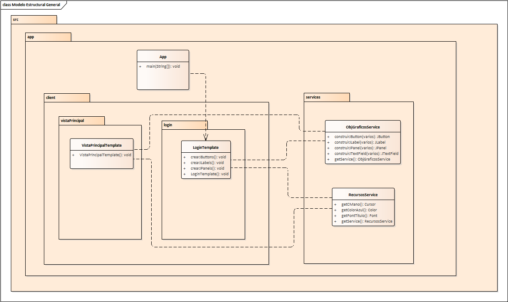
  <p>Modelo Estructural de clases aproximado de nuestro proyecto hasta el momento</p>
</div>

El anterior modelo estructural muestra de forma general y aproximada como esta conformado nuestro proyecto, que paquetes tenemos y que dependencias hasta el momento tenemos.

Recordando un poco nuestro recorrido tenemos una clase **LoginTemplate** donde su código ya se modularizo y optimizo. La interfaz gráfica se ve asi:

<div align="center">
  
  <p>Login de usuario de nuestro proyecto</p>
</div>

También tenemos una clase **VistaPrincipalTemplate** que hasta el momento esta vacía y tiene un color de fondo así:

<div align="center">
  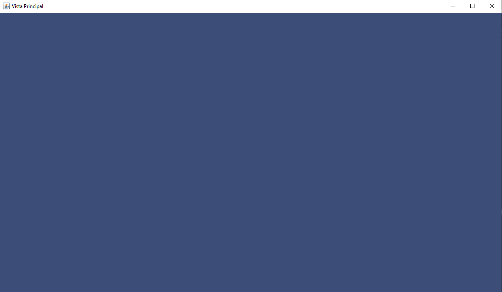
  <p>Vista Principal de nuestro proyecto</p>
</div>

# Componentes Gráficos y Eventos por Acción 

En esta clase vamos a abarcar 2 Temas principales y ver 3 items importantes que están corelacionados entre ambos temas:

## Temas
* **Componentes Gráficos**
* **Eventos: ActionListener (Evento por acción)**

### Items
* Concepto general de Componente Gráfico.
* ActionListener (Evento por acción)
* Implementación de Componente Gráfico.

# Concepto general de Componente Gráfico

Muchos proyectos normalmente necesitan bastantes interfaces gráficas para soportar todos los requerimientos y todos los datos que se quieren mostrar a un cliente. Se podría crear una  ventana separada por cada vista que se quiere mostrar al cliente, sin embargo las aplicaciones hoy en dia se caracterizan por manejar toda su información, acciones y vistas a traves de una sola ventana. Esto se conoce como una aplicación **Single-Page App**.

<div align="center">
  
  <p>Spotify ejemplo de una aplicación Single-Page App</p>
</div>

Un ejemplo es la aplicación de escritorio de **Spotify** pueden notar que cuando se usa este programa en nuestro computador este no esta abriendo una ventana nueva por cada opción que nosotros damos. La aplicación se encarga de gestionar que elementos mostrar en la misma ventana y que elementos quitar dependiendo de la opción del usuario.

Si todo el código de la aplicación estuviera contenido en una sola ventana sería realmente desastroso, habría una infinidad de objetos gráficos en una sola clase, una cantidad de lineas de código inmensa y el entendimiento y la mantenibilidad del código seria realmente difícil. 

Una buena forma de tener un código organizado, con una responsabilidad clara de cada parte del proyecto y una modularidad coherente es la implementación de **Componentes gráficos**. De esta forma nuestras aplicaciones estarán separadas adecuadamente. Por ejemplo una posible separación por componentes para la aplicación de Spotify seria la siguiente: 

<div align="center">
  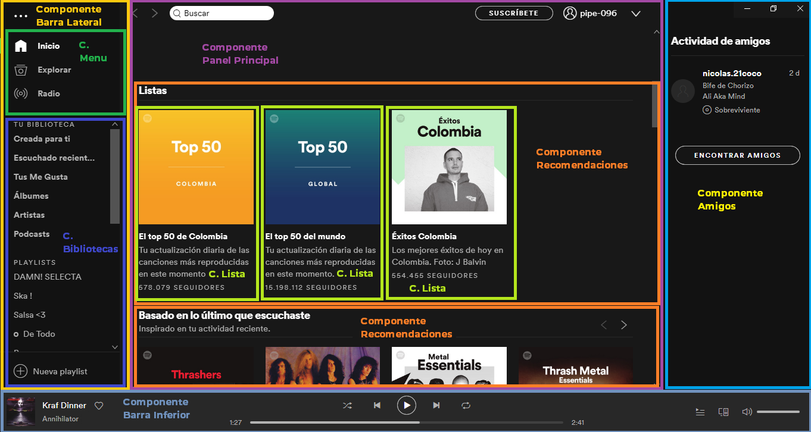
  <p>Spotify posible componetización de la aplicación</p>
</div>

De la anterior imágen se puede observar varias particularidades:
* Un Componente gráfico puede contener a otro componente por ejemplo el **Componente Panel Principal** contiene varios componentes mas.
* Un Componente puede cambiar de contenido, por ejemplo si el usuario escoge una lista u oprime cualquier botón es muy probable que el **Componente Panel Principal** remueva su contenido y llame a otros componentes para satisfacer lo que quiera ver el usuario.
* Un componente puede ser **reutilizable**, note por ejemplo que el **componente Recomendaciones** se esta llamando varias veces y no se necesita crear distintas clases para mostrarlo en pantalla las veces que sea necesario, simplemente se puede crear un arreglo de componentes de ese tipo para mostrarlo varias veces. Incluso si en otra parte de la aplicación se requiera este componente podría fácilmente ser llamado y usarse.
* Cada componente cumple una función especifica lo que le da la cualidad a la aplicación de dividir responsabilidades y ademas es mucho mas fácil asi comprender el código de una sola parte en especifico que de toda una aplicación.

La componetización de una aplicación depende del programador, se podría ser demasiado riguroso y crear un componente gráfico por cada aspecto, o se podrían crear algunos componentes gráficos que conformen toda la aplicación. 

A continuación veremos como esta conformado un **componente gráfico**.

## Creación de un componente Gráfico y sus partes.

Un componente gráfico se conforma principalmente de 2 clases:
* **Clase Template:** Que se encarga unicamente de la muestra de objetos gráficos por pantalla ademas de la muestra de información que el usuario requiera y es el medio por el cual el usuario podrá interactuar, mostrar y recolectar información.
* **Clase Component:** Esta clase es la encargada de soportar la lógica del componente. Esta incluye el manejo de eventos, el manejo de la información que se vaya a mostrar o recolectar en la clase Template, el llamado a servicios necesarios para la traer o entregar información externa etc.

Algunas particularidades que hay que explicar son:

* Ambas clases deben estar en un único paquete y deben tener una comunicación única bidireccional ya que la clase **Template** necesitara conocer partes de la clase **Component** y viceversa. 
* La clase **Template** es una clase aislada y solo es conocida por su clase **Component** que la acompaña, para la comunicación de varios componentes se realizara a traves de la clase **Component**.
* Antes se dijo que la clase **Component** es la encargada de la comunicación con servicios sin embargo existe una excepción con los servicios creados anteriormente **ObjGraficosService** y **RecursosService** ya que están orientados a la construcción de las clases template. El resto de servicios estará orientado al manejo de datos y esos son los que gestionara la clase **Component** de ser necesario.

Para crear nuestro primer componente gráfico vamos a posicionarnos en el paquete **login** y crearemos una clase llamada **LoginComponent**.

<div align="center">
  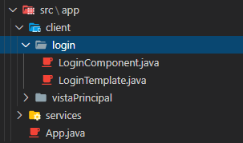
  <p>Creación clase Component dentro del paquete vistaPrincipal</p>
</div>

A continuación se explicaran ciertas características de cada una de las clases que conforman un componente.

***Nota:** Aunque ya hemos trabajado con clases Template habrán nuevas características que serán necesarias e importantes.* 

## Clase Template

Esta clase se encargara unicamente de mostrar en pantalla las diferentes objetos gráficos con las que el usuario interactuará y mostrará los valores obtenidos de la lógica realizada por la clase **Component**. Se caracteriza por:

- Hereda de una clase que le da propiedades gráficas, esta podría ser por ejemplo **JFrame**, **JPanel**, **Canvas** etc. Esta es la clase que va a ser mostrada al usuario.
<div align="center">
  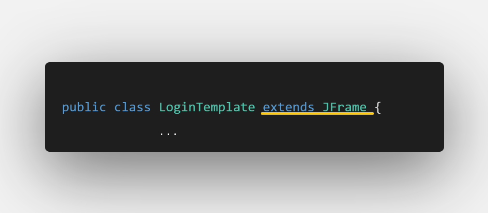
  <p>Ejemplo Herencia en clase Template</p>
</div>

Note que aunque en este ejemplo y hasta el momento hemos creado clases **Template** que heredan de un **JFrame** también podrían heredar de un **JPanel** por ejemplo.
- Importará las librerías necesarias para configurar objetos gráficos en pantalla como hemos visto en clases anteriores.

- Recibe como parámetro en el constructor un objeto de la clase component y la iguala a un objeto creado de la misma referencia, esta tecnica es llamada **inyeccion de dependencia**.
<div align="center">
  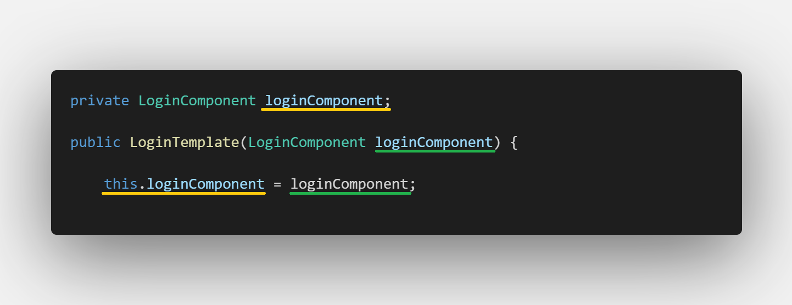
  <p>Inyección de la clase Component</p>
</div>

- Para que la clase **Component** pueda realizar acciones con los objetos gráficos de la misma, a la clase **Template** se le deben añadir métodos **get** para los objetos que serán necesarios manipular. Por ejemplo para la clase **LoginTemplate** se generan los siguientes:

```javascript
public JButton getBCerrar(){
    return this.bCerrar;
}

public JButton getBEntrar(){
    return this.bEntrar;
}

public JButton getBRegistrarse(){
    return this.bRegistrarse;
}

public JButton getBOpcion1(){
    return this.bOpcion1;
}

public JTextField getTNombreUsuario(){
    return this.tNombreUsuario;
}

public JPasswordField getTClaveUsuario(){
    return this.tClaveUsuario;
}

public JComboBox<String> getCbTipoUsuario(){
    return this.cbTipoUsuario;
}

public JCheckBox getCheckSi(){
    return this.checkSi;
}

public JCheckBox getCheckNo(){
    return this.checkNo;
}
```

## Clase Component

Esta clase se encarga de manejar toda la lógica que la clase template podría necesitar, esta puede incluir manejo de eventos (cuando se oprime un botón, cuando se da click con el Mouse, cuando se oprime una tecla etc.) manejo de servicios, manejo de información etc.
También tiene ciertas Características como:

- Puede implementar las interfaces (interfaz es diferente a interfaz Gráfica) que proporcionan la escucha de eventos (no es obligatorio pero es muy común), por ejemplo un **ActionListener** que se activa cuando el usuario oprime un botón. De ser necesario implementa otras interfaces que gestionan otro tipo de eventos como **MouseListener**, **MouseMotionListener**, **KeyListener** etc.
<div align="center">
  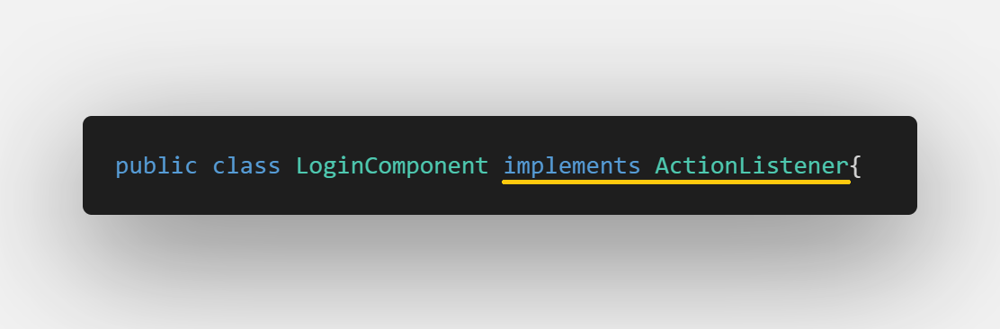
  <p>Ejemplo de implementación de una interfaz</p>
</div>

- Cuando se implemente cualquier interfaz esta pedirá que por defecto se implementen también los métodos de esta en la clase, asi que debe realizarse. En este caso la Interfaz **ActionListener** exige la implementación del método **actionPerformed**, por lo general el editor informara del error y se podrá implementar de forma automática. Es en este método donde se gestionara una acción cada vez que el usuario de click a un botón.
<div align="center">
  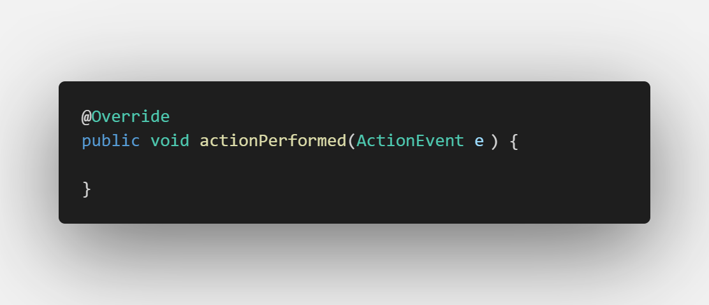
  <p>Método implementado de la interfaz ActionListener</p>
</div>

- Se tiene un objeto del tipo de la clase **template** y para ejemplificar este objeto se debe enviar como parámetro una referencia a esta misma clase, para eso usamos la palabra **this**, que indica que se esta enviando como parametro a ella misma y asi completar la inyeccion de dependencia.

<div align="center">
  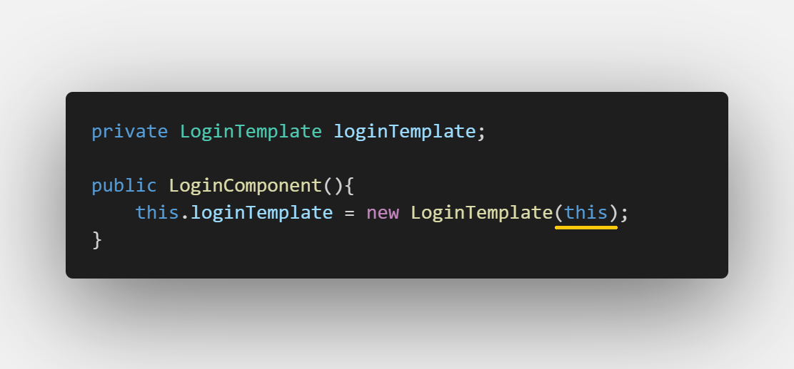
  <p>Inyección desde la clase Component</p>
</div>

## Explicación Inyección de dependencia

Esta inyeccion se hace de esta forma para tener una comunicación permanente entre las dos clases de forma bidireccional. Asi cuando la clase **Template** necesite algo de la lógica de la clase **Component** podrá hacerlo a traves de su objeto y de igual manera cuando la clase **Component** quiera enviar información a la interfaz gráfica podrá hacerlo a traves del objeto de esta.
A continuación se puede ver un esquema general de un componente Gráfico.

<div align="center">
  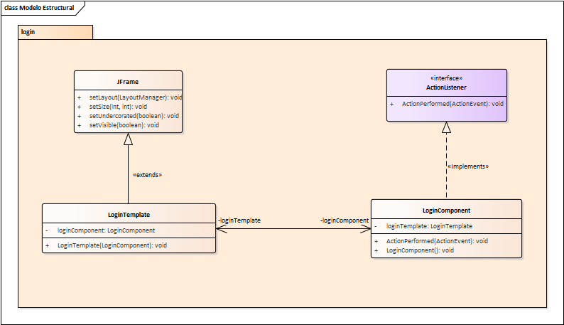
  <p>Diagrama de clases de un componente Gráfico</p>
</div>


Visto esto en objetos en memoria se ve de la siguiente manera, y se puede denotar una comunicación directa entre los objetos de forma bidireccional:
<div align="center">
  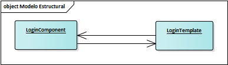
  <p>Comunicación bidireccional entre objetos</p>
</div>

Una forma diferente de hacer esto (pero errónea) seria la de la ejemplificación del objeto de la clase contraria de forma individual de la siguiente manera:

- En la clase **LoginComponent**:

<div align="center">
  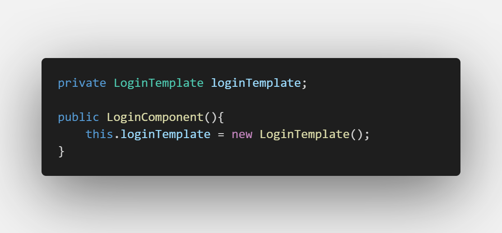
  <p>Ejemplificación común desde la clase LoginComponent</p>
</div>

Se puede notar que ya no se envía el **this** por parámetro.

- En la clase **LoginTemplate**:

<div align="center">
  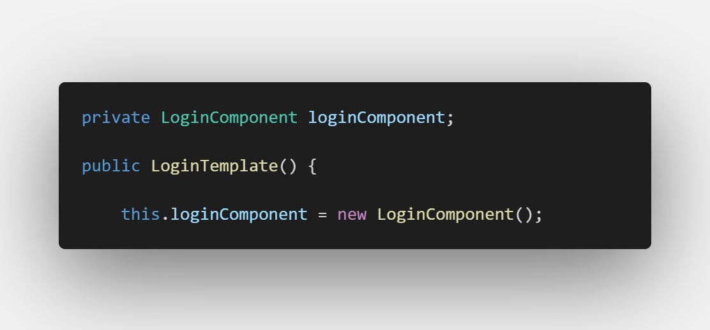
  <p>Ejemplificación común desde la clase LoginTemplate</p>
</div>
Se puede notar que de esta forma ya no recibe nada por parámetro y ejemplifica el objeto de forma normal.

De esta forma se podría pensar que se realizo de manera correcta un canal de comunicación entre ambas clases, sin embargo si miramos el modelo de objetos podemos darnos cuenta que no es asi:

<div align="center">
  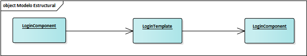
  <p>Comunicación unidireccional entre objetos</p>
</div>

Lo que pasa en realidad es que la clase **LoginComponent** crea un objeto de tipo **LoginTemplate** y esta a su vez crea **otro** objeto de tipo **LoginComponent** por lo que ahora en tiempo de ejecución hay dos objetos de la misma clase y no hay una sola comunicación directa entra ambos objetos.

**Nota:** El anterior proceso de creación de clase **Component** e implementación de inyeccion de dependencia se debe realizar también con VistaPrincipal.

# ActionListener (Evento por acción)

Un evento ocurre cuando el usuario realiza alguna acción sobre la interfaz gráfica y desencadena un proceso que al final devolverá un resultado (traer información requerida, guardar información, mostrar una parte de la aplicación, cerrar la aplicación etc.). 
Un **ActionListener** es el evento mas básico pero a la vez mas importante, se puede realizar con una gran variedad de objetos gráficos aunque lo ideal es que se use con los botones de la interfaz gráfica.

Ya tenemos nuestra clase **LoginTemplate** que contiene todos los botones en la ventana, y tenemos la clase **LoginComponent** que ha implementado la interfaz **ActionListener** y esta lista para recibir eventos. Para poder crear estas acciones debemos darle una configuración adicional a nuestros JButton, esta sera  **addActionListener**.

```javascript
bEntrar.addActionListener(loginComponent);
```
se puede observar que el método:
* **addActionListener:** Recibe por parámetro un objeto tipo ActionListener.

Como nuestra clase **LoginComponent** implementa de esta interfaz automáticamente se convierte en un objeto de ese tipo por lo que podemos ingresar en el objeto que creamos de la clase como argumento en el método.

**Nota:** Como es un método de Configuración deberá estar ubicado justo después de la llamada al servicio y antes de que se adicione el botón.

También queremos darle acciones al botón de Registrarse y al botón de cerrar y al botón opción 1 por lo que realizaremos la misma configuración.

```javascript
bCerrar.addActionListener(loginComponent);
```
```javascript
bRegistrarse.addActionListener(loginComponent);
```
```javascript
bOpcion1.addActionListener(loginComponent);
```

Ahora en nuestra clase **LoginComponent** vamos a probar si realmente funciona, para eso vamos a mostrar un mensaje en pantalla. Nos ubicamos en el método implementado **actionPerformed** y escribimos:

<div align="center">
  
  <p>Prueba 1 de nuestro evento</p>
</div>

Note que estamos llamando un método que no habíamos visto antes:

* **JOptionPane.ShowMessageDialog():** Muestra un mensaje de alerta por pantalla a traves de una ventana emergente y recibe por parámetros:
  * **Componente (Ventana):** Recibe un como parámetro la ventana relativa donde se quiere mostrar la ventana emergente, si se envía como null, el mensaje se vera en la mitad del monitor, si no, se vera en la mitad de la ventana enviada.
  * **Mensaje:** Recibe un String y representa el mensaje que se quiere mostrar en pantalla.
  * **Titulo:** Recibe un String por parámetro y representa el titulo de la ventana emergente.
  * **Tipo de Mensaje:** Recibe un entero donde se le indica el tipo de mensaje representado con un icono, donde:
    * 0: Representa un mensaje de error. 
    * 1: Representa un mensaje Informativo. 
    * 2: Representa un mensaje de Advertencia. 
    * 3: Representa un mensaje de Pregunta.

Una vez corremos nuestra aplicación podemos notar que al darle click a cualquiera de los 4 botones a los cuales se les adiciono el **ActionListener** saldrá un mensaje emergente.

<div align="center">
  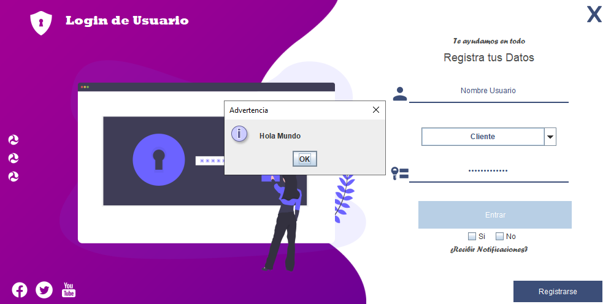
  <p>Mensaje emergente al oprimir el botón bEntrar</p>
</div>

Podemos observar que si intentamos dar click alguno de los dos botones excluidos (bOpcion2 o bOpcion3) no tendrá  ningún efecto debido a que no se agrego la propiedad de adicionar un **ActionListener**. 

Sin embargo no queremos que todos los botones realicen la misma acción, de hecho necesitamos muchas veces que cada botón haga acciones diferentes. Debemos realizar una discriminación de los botónes para separar acciones.

### Discriminación por Texto

La discriminación por texto, realiza acciones dependiendo del texto que contiene cada botón, por ejemplo:

<div align="center">
  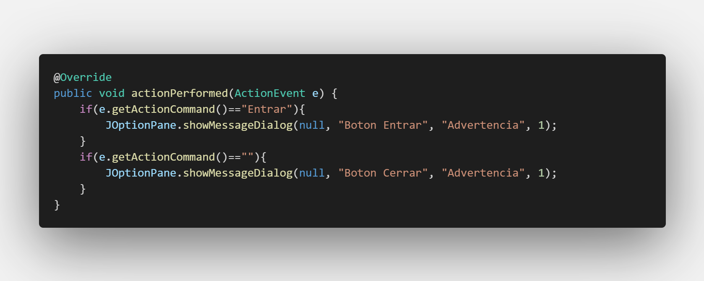
  <p>Discriminación por medio de Texto</p>
</div>

Se puede notar que para realizar esta discriminación debemos usar el objeto recibido por defecto **e** de tipo **ActionEvent**  y llamar a su método:

* **getActionCommand**: Que devuelve un String del comando del botón oprimido **El texto del botón** y lo comparamos con la coincidencia del texto.

Si corremos la aplicación anterior y damos click en el botón Cerrar como este no contiene texto sino una imagen mostrara el mensaje **"Botón Cerrar"** y al darle click al botón entrar mostrara el mensaje **"Botón Entrar"**, sin embargo si damos click en el botón bRegistrarse no tendrá ningún efecto asi se le haya añadido la propiedad de adición de **ActionListener** ya que no hemos configurado ninguna acción para ese botón.

Sin embargo este enfoque tiene una pequeña particularidad que podría ser una desventaja, si por ejemplo damos click al botón (bOpcion1), saldrá el mismo mensaje que en el botón cerrar, esto debido a que ninguno de los dos tiene texto. 

<div align="center">
  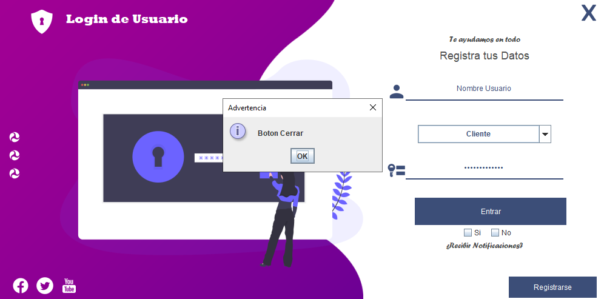
  <p>Mismo mensaje de alerta en diferentes botones</p>
</div>

En nuestras interfaces vamos a tener varios botones que no contienen texto (Botones que solo contienen una imagen) ¿como vamos a discriminarlos unos con los otros?. 
Quizás debemos tomar otro enfoque.

### Discriminación por Objeto

La discriminación por objeto realiza acciones de acuerdo al objeto del botón que fue activado, por ejemplo:

<div align="center">
  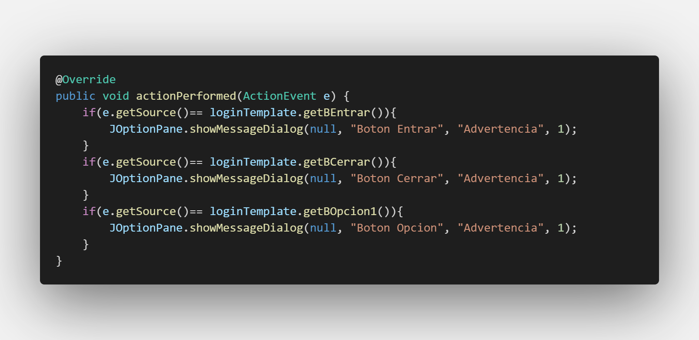
  <p>Discriminación por medio de Objetos</p>
</div>

De igual forma debemos usar el objeto recibido por defecto **e** de tipo **ActionEvent**  y esta vez llamar a su método:

* **getSource**: Que devuelve un objeto del botón el cual fue oprimido y lo comparamos con el objeto al que queremos separar la acción.

Si corremos la aplicación anterior y damos click en el botón Cerrar se mostrara el mensaje **"Botón Cerrar"** y al darle click al botón opcion1 mostrara el mensaje **"Botón opción"** por lo que quedara solucionado el problema, igualmente si damos click en el botón bRegistrarse no tendrá ningún efecto asi se le haya añadido la propiedad de adición de **ActionListener** ya que no hemos configurado ninguna acción para ese botón.

Ahora una buena practica es llamar desde el método **actionPerformed** a otros métodos que realicen los procesos en caso de ser muy extenso el código.

Por ejemplo: 
* El botón **bCerrar** Se encargara de cerrar la aplicación y el código no es para nada extenso asi que se puede mantener adentro.
* Los botones **bRegistrarse y bOpcion2** solo mostraran por pantalla un mensaje asi que el codigo permanece adentro.
* El botón **bEntrar** en cambio va a obtener lo que escriba el usuario en tNombreUsuario, tClaveUsuario, cmbTipoUsuario y en los CheckBox y luego ingresar a la vista principal por lo que es preferible escribir un método externo que realice esta acción.

**Agregando mensajes en los botones bRegistrarse y bOpcion2**

```javascript
if(e.getSource()== loginTemplate.getBOpcion1()){
    JOptionPane.showMessageDialog(null, "Boton Opcion", "Advertencia", 1);
}
if(e.getSource()== loginTemplate.getBRegistrarse()){
    JOptionPane.showMessageDialog(null, "Boton Registro", "Advertencia", 1);
}
```

**Cerrando la aplicación a traves del botón bCerrar**
```javascript
if(e.getSource()== loginTemplate.getBCerrar()){
    System.exit(0);
}
```
Se puede observar en el codigo anterior que la forma para cerrar la aplicación es usando un **System.exit(0)**.

**Agregando funcionalidad de muestra de datos y entrada a vista principal desde bEntrar**
```javascript
if(e.getSource()== loginTemplate.getBEntrar()){
    this.mostrarDatosUsuario();
    this.entrar();
}
```

### **Obtención de datos desde formularios de interfaz gráfica**

Lo primero que haremos es crear nuestro método **MostrarDatosUsuario** en nuestra clase, también crearemos el método **entrar** para evitar inconvenientes:
```javascript
public void mostrarDatosUsuario(){

}

public void entrar(){

}
```
Para poder obtener el texto de alguno de los objetos gráficos es necesario obtener primero el objeto, esto se realizara a traves del objeto de la **clase Template** seguido del método **get** correspondiente, una vez obtenido el objeto es posible obtener el valor de lo escrito o escogido por el usuario de la siguiente manera:

```javascript
public void mostrarDatosUsuario(){
    loginTemplate.getTNombreUsuario();
}
```
Para el anterior objeto como es un JTextField la forma de obtener el texto es mediante el método:
* **getText:** que retorna el texto escrito por el usuario en forma de String.

```javascript
public void mostrarDatosUsuario(){
    loginTemplate.getTNombreUsuario().getText();
}
```

Sin embargo para obtenerlo se debe igualar a una variable por lo que creamos una variable llamada **nombreUsuario** de tipo String y la igualamos a la sentencia:
```javascript
public void mostrarDatosUsuario(){
    String nombreUsuario = loginTemplate.getTNombreUsuario().getText();
}
```
El anterior proceso se puede realizar de la misma manera con el JPasswordField:

```javascript
    String claveUsuario = loginTemplate.getTClaveUsuario().getText();
```
**Nota:** El codigo anterior debe estar adentro del método **mostrarDatosUsuario**.

Para un **JComboBox** es necesario llamar al método:
* **getSelectedItem:** que retorna un objeto de la selección realizada por el usuario. 

Como nosotros queremos obtener el resultado en forma de String debemos realizar un **Cast** de datos a String y de igual modo se iguala con una variable String creada, de la siguiente manera:
```javascript
    String tipoUsuario = ((String) loginTemplate.getCbTipoUsuario().getSelectedItem());
```
**Nota:** El codigo anterior debe estar adentro del método **mostrarDatosUsuario**.

Para saber cual de las dos opciones de los JCheckBox fue escogida primero crearemos una variable String que estará vacía:
```javascript
String check= "";
```
Seguido de eso se va a preguntar si alguno de los dos botones fue seleccionado mediante el método:
* **isSelected:** que retorna un booleano que estará en true si se selecciono o false en caso de que no.
En caso de ser seleccionado se dará un nuevo valor a la variable **Check** ("Si" en caso de seleccionar el **checkSi** o "No" en caso de seleccionar el **checkNo**).

```javascript
if(loginTemplate.getCheckSi().isSelected())
    check="si";
if(loginTemplate.getCheckNo().isSelected())
    check="no";
```

**Nota:** El codigo anterior debe estar adentro del método **mostrarDatosUsuario**.

Ahora mostraremos el mensaje mediante un JOptionPane de la siguiente manera: 

```javascript
JOptionPane.showMessageDialog(
    null, "Nombre Usuario: "+nombreUsuario+"\n Clave Usuario: "+claveUsuario+ 
    "\nTipo Usuario: "+tipoUsuario+"\n¿Notificaciones?: "+check, "Advertencia", 1
);
```
Pueden notar que la forma de encadenar un texto es mediante el uso de **+** y también recalcar que con **\n** se realiza un salto de linea.

**Nota:** El codigo anterior debe estar adentro del método **mostrarDatosUsuario**.

Si abrimos nuestra aplicación y damos click en el botón entrar se podrá ver un resultado como el siguiente:

<div align="center">
  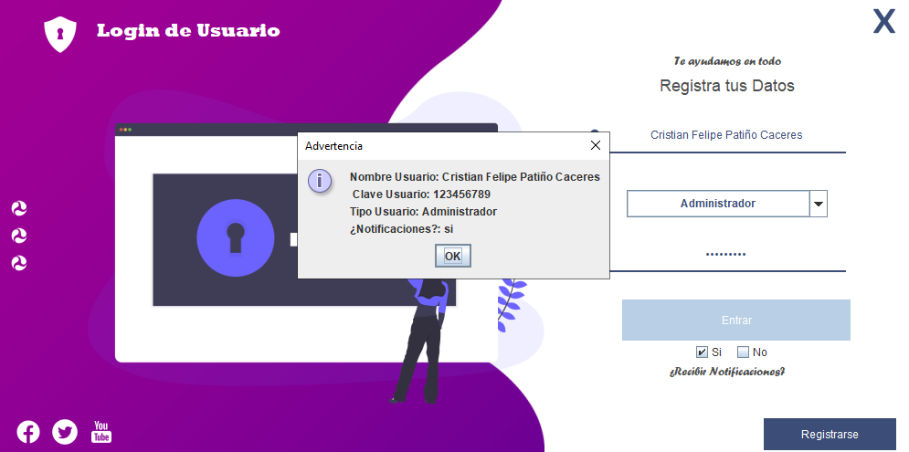
  <p>Ejemplo de obtención de datos a traves de evento de botón</p>
</div>

De esta forma hemos comprobado que nuestros métodos para la obtención del valor de nuestros objetos gráficos funciona perfectamente.